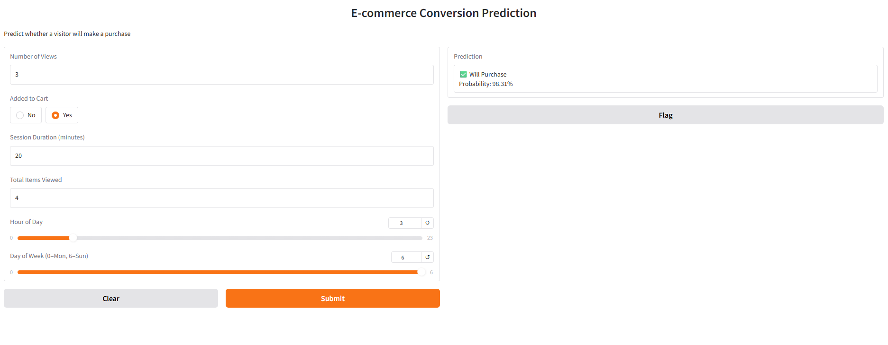
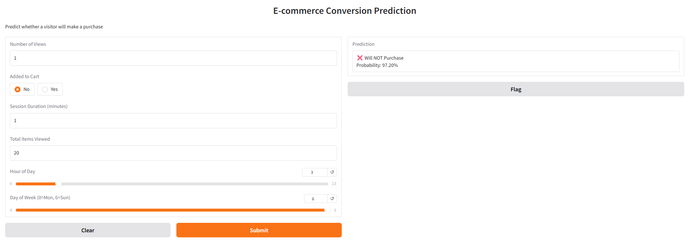

# E-commerce Conversion Prediction

A machine learning project that predicts whether a visitor will make a purchase based on their behavioral data from an e-commerce website.

## Problem Statement
E-commerce businesses lose potential customers every day due to cart abandonment and low conversion rates. This project builds a model that predicts purchase intent based on user behavior, enabling targeted interventions (discounts, popups, reminders) to increase conversions.

## Dataset
[RetailRocket E-commerce Dataset](https://www.kaggle.com/datasets/retailrocket/ecommerce-dataset) — 2.7M real user events (view, add to cart, purchase) collected over 4.5 months.

## Results
| Model | ROC-AUC | Precision | Recall | F1 |
|-------|---------|-----------|--------|----|
| Random Forest | 0.979 | 0.72 | 0.60 | 0.65 |
| XGBoost (tuned) | 0.995 | 0.61 | 0.82 | 0.70 |

## Tech Stack
- **ML:** XGBoost, Scikit-learn, Optuna, MLflow
- **API:** FastAPI
- **UI:** Gradio
- **Deployment:** Docker

## Project Structure
├── csv/               # Raw and processed data (not included)
├── data/              # Data loading, EDA, preprocessing
├── features/          # Feature engineering
├── models/            # Model training, tuning, evaluation
├── api/               # FastAPI endpoint + Gradio UI
├── Dockerfile
└── requirements.txt


## Pipeline
1. **EDA & Cleaning** — explored 2.7M events, removed duplicates, converted timestamps
2. **Feature Engineering** — aggregated events to visitor+item level features
3. **Model Training** — compared Random Forest vs XGBoost
4. **Hyperparameter Tuning** — Optuna with 20 trials
5. **Experiment Tracking** — MLflow
6. **Serving** — FastAPI REST API + Gradio UI + Docker

## Setup
1. Download dataset from [Kaggle](https://www.kaggle.com/datasets/retailrocket/ecommerce-dataset) and place CSV files in `csv/`
2. Install dependencies: `pip install -r requirements.txt`
3. Run with Docker:
```bash
docker build -t ecommerce-prediction .
docker run -p 8000:8000 ecommerce-prediction
```
4. Open `http://127.0.0.1:8000/docs` for the API or run `python api/gradio_app.py` for the UI


## Demo

